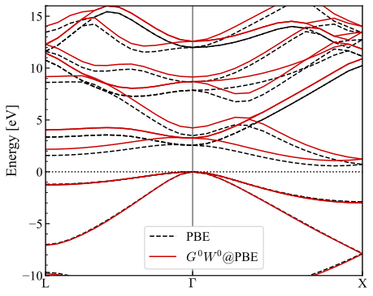

# *G*{sup}`0`*W*{sup}`0` quasiparticle band structure from FHI-aims data

This tutorial calculates the one-shot *GW* quasiparticle band structure of
silicon. FHI-aims performs the PBE calculation and writes the GreenX/LibRPA
dataset; the LibRPA driver then evaluates the quasiparticle energies on the
regular k-grid and along the requested band path.

```{note}
The numerical settings below are intended to demonstrate the workflow. Check
basis-set, k-point, and frequency-grid convergence before using the results in
production calculations.
```

## 1. Prerequisites

You need:

- FHI-aims built with GreenX support (`USE_GREENX=ON`);
- LibRPA built with the driver and
  [`LIBRPA_USE_LIBRI=ON`](<librpa-use-libri>); and
- an MPI launcher compatible with both executables.

## 2. Generate the FHI-aims dataset

The example uses PBE, a 4 × 4 × 4 k-grid, 16 minimax frequency points, and two
band-path segments, L–Γ and Γ–X. The relevant part of `control.in` is:

```text
# Basic model
xc               pbe
k_grid           4 4 4
occupation_type  gaussian 0.001

# GW switches
qpe_calc         gw_expt
frequency_points 16
anacon_type      1

# Band k-paths
output band   0.50000  0.50000  0.50000   0.00000  0.00000  0.00000 13 L G
output band   0.00000  0.00000  0.00000   0.50000  0.00000  0.50000 13 G X

# Export dataset for LibRPA
output librpa

[light species default for Si]
```

Most settings are the same as in a standard periodic *GW* calculation in
FHI-aims; `output librpa` is the key addition.

The corresponding `geometry.in` is:

```text
lattice_vector   3.8301668167   0.0000000000   0.0000000000
lattice_vector   1.9150834084   3.3170217640   0.0000000000
lattice_vector   1.9150834084   1.1056739213   3.1273181102
atom_frac        0.0000000000   0.0000000000   0.0000000000  Si
atom_frac        0.2500000000   0.2500000000   0.2500000000  Si
```

Place both files in a `dataset` directory and run FHI-aims there:

```bash
cd dataset
mpirun -np 4 /path/to/aims.x > aims.out 2> aims.err
```

The `output librpa` directive writes the structure, basis, eigenstate, RI
coefficients, Coulomb matrices, dielectric head, and band-path data required by
the LibRPA driver. The generated dataset for this example is about 500 MiB.
Its size and generation time depend strongly on the basis and numerical grids.

## 3. Configure LibRPA

Create a sibling `librpa` directory containing this `librpa.in`:

```text
task = g0w0
input_dir = ../dataset
nfreq = 16
option_dielect_func = 0
replace_w_head = t
parallel_routing = libri
```

`task = g0w0` calculates both regular-k-grid and band-path quasiparticle
energies when band-path data are present. `nfreq` must match the FHI-aims
frequency grid.

`replace_w_head` uses the macroscopic dielectric function written by FHI-aims
to correct the head of the dielectric matrix and improve k-point convergence.

## 4. Run LibRPA

Run the driver from the `librpa` directory so that `input_dir = ../dataset`
resolves correctly:

```bash
cd librpa
export OMP_NUM_THREADS=1
mpirun -np 4 /path/to/LibRPA/build/chi0_main.exe > librpa.out 2> librpa.err
```

A successful run ends with `libRPA finished successfully`. The run used to
refresh this tutorial employed four MPI ranks and one OpenMP thread per rank
and took about 1.4 hours. Runtime is hardware-dependent, and additional
MPI ranks or OpenMP threads may reduce it.

## 5. Inspect the quasiparticle energies

The first regular-k-grid block in the refreshed `librpa.out` includes:

```text
Printing quasi-particle energy [unit: eV]

spin  1, k-point    1: (0.00000, 0.00000, 0.00000)
----------------------------------------------------------------------------------------------------------------------------
State              occ             e_mf             v_xc            v_exx           ReSigc           ImSigc             e_qp
----------------------------------------------------------------------------------------------------------------------------
    1          2.00000      -1789.50277       -153.07760       -244.87703          8.90361          3.15363      -1872.39859
...
   11          2.00000        -17.67291        -12.19859        -19.21812          6.69555         -0.86361        -17.99689
   12          2.00000         -5.63619        -13.27559        -14.75075          1.24875         -0.00015         -5.86260
   13          2.00000         -5.63548        -13.27912        -14.75356          1.24872         -0.00015         -5.86120
   14          2.00000         -5.63533        -13.27943        -14.75386          1.24867         -0.00015         -5.86108
   15          0.00000         -3.07993        -11.57831         -7.20939         -3.90057         -0.01063         -2.61157
   16          0.00000         -3.07901        -11.57980         -7.21005         -3.90144         -0.01064         -2.61070
   17          0.00000         -3.07776        -11.58158         -7.21096         -3.90159         -0.01066         -2.60874
   18          0.00000         -2.14654        -14.88107         -9.67057         -4.69196         -0.01374         -1.62800
...
```

The columns contain:

- `State`: one-based band index $n$;
- `occ`: input occupation $f_{nk}$;
- `e_mf`: input Kohn–Sham eigenvalue $E^{\mathrm{KS}}_{nk}$;
- `v_xc`: input exchange-correlation potential $v^{\mathrm{xc}}_{nk}$;
- `v_exx`: exact-exchange potential $v^{\mathrm{exx}}_{nk}$;
- `ReSigc` and `ImSigc`: real and imaginary parts of the correlation
  self-energy $\Sigma^{\mathrm{c}}_{nk}$; and
- `e_qp`: quasiparticle energy

  $$
  E^{\mathrm{QP}}_{nk} = E^{\mathrm{KS}}_{nk} - v^{\mathrm{xc}}_{nk} + v^{\mathrm{exx}}_{nk} + \Re\Sigma^{\mathrm{c}}_{nk}.
  $$

All energies in this table are in eV.

## 6. Plot the band structure

When band-path data are present, `task = g0w0` writes:

- `KS_band_spin_<ispin>.dat`: input Kohn–Sham band structure;
- `EXX_band_spin_<ispin>.dat`: non-self-consistent exact-exchange band
  structure; and
- `GW_band_spin_<ispin>.dat`: *GW* quasiparticle band structure.

These files follow the FHI-aims band-output format. Their raw energies use
LibRPA's internal energy zero, so choose and document a common reference when
comparing calculations. The plot below aligns the PBE and *GW* results to their
respective valence-band maxima and omits the five highest bands, which exhibit
large errors from the localized resolution-of-identity approximation.

For this example, both calculations yield an indirect fundamental gap, with the
valence-band maximum at Γ and the conduction-band minimum along Γ–X. The gap is
0.57 eV for PBE and 1.08 eV for *GW*. These values should not be treated as
fully converged.

:::{figure-md} fig-band-si
{align=center}

PBE and one-shot *GW* band structures of silicon.
:::

The [result archive](solution.tar.gz) contains the complete FHI-aims and LibRPA
inputs, the refreshed outputs, the three band files, the generated figure, and
the plotting script. The script uses NumPy and Matplotlib.
